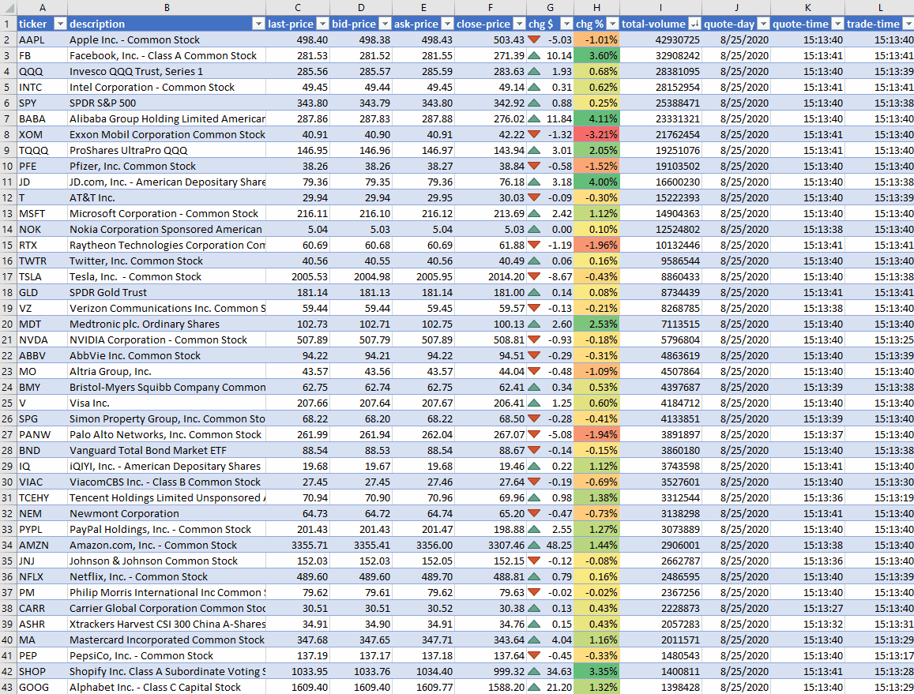

# TD Ameritrade RTD

## Caveat

> This is still under development and haven't been tested extensively. You may exprience various issues. Also the Python code quality is not where I want to be yet.

## Introduction

* TD Ameritrade offers Level I and II live stream quotes free of charge if you have an account with them. (You can open an account without any deposit). See https://www.tdameritrade.com/api.page for more details.
* This Excel TD RTD utilizes the Level I live stream quotes to update TD RTD stockquote function in Excel in realtime.

## Features

* Automatic OAuth login to your TD Ameritrade via web browser.
* Refresh token is encrypted and stored under %APPDATA% folder.
* Currently supports all Level I livet stream quotes.
    * [Level I Quote Document from TD](https://developer.tdameritrade.com/content/streaming-data#_Toc504640597)
    * For full  fleld list look for `level_one_quote` in [fields.py](https://github.com/chaelim/ExcelRTD/blob/master/python/tdapi/fields.py)

## Demo

[TD RTD Demo workbook](https://github.com/chaelim/ExcelRTD/blob/master/python/demo/TD_rtd_demo.xlsx)

> It's actual normal update speed not fast forward play.

